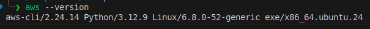
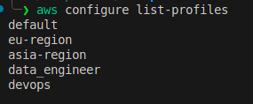
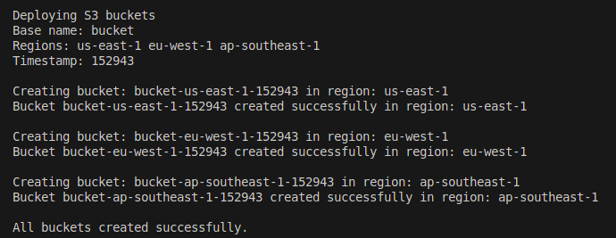
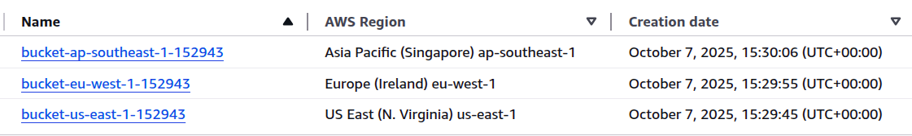

# Week 1: AWS CLI Deployment

This project demonstrates AWS CLI setup and deployment practices as part of a DevOps learning curriculum.

## Overview

Learn essential AWS CLI configuration, authentication, and multi-region S3 bucket deployment workflows for cloud-based operations.

## Contents

- AWS CLI installation and configuration
- Profile management for multiple environments
- Multi-region S3 bucket deployment scripts
- Visual guides and documentation

## Scripts

### S3 Bucket Deployment
- `scripts/deploy-s3-buckets.sh` - Creates S3 buckets across multiple regions
- `scripts/.env` - Environment configuration for bucket naming and regions

### AWS CLI Commands Comparison

**s3api vs s3 mb:**
- `aws s3api create-bucket` - Low-level API with full control over bucket configuration
- `aws s3 mb` - High-level command for simple bucket creation

The scripts use `s3api` for:
- Region-specific LocationConstraint configuration
- Versioning enablement
- Tagging support
- Better error handling

## Images (Proof of Concept)

**AWS CLI setup and configuration** - Demonstrates successful AWS CLI installation and version verification. Use `aws --version` to confirm your installation shows the correct version number and Python dependencies.

**Multi-profile configuration examples** - Shows multiple AWS profiles configured for different environments (dev, prod, staging). Use `aws configure list-profiles` to display all configured profiles in your development environment. This enables switching between different AWS accounts or regions seamlessly.

**S3 bucket creation confirmation** - Terminal output showing successful execution of the deployment script with bucket creation across multiple regions. Displays the bucket names, regions, and confirmation messages from the AWS CLI commands.

**AWS Console bucket verification** - AWS Management Console view confirming the buckets were successfully created and are visible in the S3 service dashboard. This validates that the CLI commands executed properly and the resources exist in your AWS account.

## Regions Covered

- us-east-1 (N. Virginia)
- eu-west-1 (Ireland)
- ap-southeast-1 (Singapore)

## Getting Started

1. Install AWS CLI
2. Configure your credentials and profiles
3. Update `scripts/.env` with your preferences
4. Run `./scripts/deploy-s3-buckets.sh` to create buckets

## License

MIT License - see [LICENSE](LICENSE) file for details.