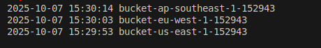

# Week 1: AWS CLI Deployment

This project demonstrates AWS CLI setup and deployment practices as part of a DevOps learning curriculum.

## Overview

Learn essential AWS CLI configuration, authentication, and multi-region S3 bucket deployment workflows for cloud-based operations.

## Contents

- AWS CLI installation and configuration
- Profile management for multiple environments
- Multi-region S3 bucket deployment scripts
- Visual guides and documentation

## Scripts

### S3 Bucket Deployment
- `scripts/deploy-s3-buckets.sh` - Creates S3 buckets across multiple regions
- `scripts/list-resources.sh` - Lists all S3 buckets with their regions in a formatted table
- `scripts/.env` - Environment configuration for bucket naming and regions

### List Resources Script Details

The `list-resources.sh` script provides comprehensive bucket inventory management:

**Key Features:**
- Fetches all S3 buckets in your AWS account using `aws s3api list-buckets`
- Displays bucket names and their corresponding regions in a formatted table
- Handles the us-east-1 region special case (returns "None" but displays as "us-east-1")
- Includes error handling for empty accounts and inaccessible buckets
- Uses `printf` for consistent column formatting (40 chars for names, 20 for regions)

**Usage:**
```bash
./scripts/list-resources.sh
```

**Output Format:**
```
Bucket Name                              Region
------------                             --------
my-bucket-us-east-1-123456              us-east-1
my-bucket-eu-west-1-123456              eu-west-1
```

### AWS CLI Commands Comparison

**s3api vs s3 mb:**
- `aws s3api create-bucket` - Low-level API with full control over bucket configuration
- `aws s3 mb` - High-level command for simple bucket creation

The scripts use `s3api` for:
- Region-specific LocationConstraint configuration
- Versioning enablement
- Tagging support
- Better error handling


## Images (Proof of Concept)

**AWS CLI setup and configuration** - Demonstrates successful AWS CLI installation and version verification. Use `aws --version` to confirm your installation shows the correct version number and Python dependencies.


**Multi-profile configuration examples** - Shows multiple AWS profiles configured for different environments (dev, prod, staging). Use `aws configure list-profiles` to display all configured profiles in your development environment. This enables switching between different AWS accounts or regions seamlessly.


**S3 bucket creation confirmation** - Terminal output showing successful execution of the deployment script with bucket creation across multiple regions. Displays the bucket names, regions, and confirmation messages from the AWS CLI commands.


**AWS Console bucket verification** - AWS Management Console view confirming the buckets were successfully created and are visible in the S3 service dashboard. This validates that the CLI commands executed properly and the resources exist in your AWS account.


**Bucket list verification** - Command line output showing all created buckets listed using `aws s3 ls` command. This provides a quick way to verify all buckets across regions from the terminal without accessing the console.


## Regions Covered

- us-east-1 (N. Virginia)
- eu-west-1 (Ireland)
- ap-southeast-1 (Singapore)

## Prerequisites

- AWS Account with appropriate permissions
- AWS CLI v2.x installed
- Valid AWS credentials (Access Key ID and Secret Access Key)
- Basic understanding of S3 and AWS regions

## Getting Started

1. Install AWS CLI
2. Configure your credentials and profiles
3. Update `scripts/.env` with your preferences
4. Make the script executable: `chmod +x scripts/deploy-s3-buckets.sh`
5. Run `./scripts/deploy-s3-buckets.sh` to create buckets

## Key Features

- **Multi-region deployment** - Automatically creates buckets across different AWS regions
- **Versioning enabled** - All buckets have versioning turned on for data protection
- **Proper tagging** - Buckets are tagged with environment and owner information
- **Error handling** - Script includes proper error checking and validation
- **Timestamped naming** - Unique bucket names with timestamp to avoid conflicts

## Best Practices Demonstrated

- Use of environment variables for configuration
- Proper error handling with `set -e`
- Region-specific bucket creation with LocationConstraint
- Enabling versioning for data protection
- Consistent tagging strategy
- Use of low-level s3api commands for better control

## Troubleshooting

- **Bucket already exists**: Bucket names must be globally unique across all AWS accounts
- **Access denied**: Ensure your AWS credentials have S3 permissions
- **Region errors**: Verify the regions in `.env` are valid AWS regions
- **Script permissions**: Make sure the script is executable with `chmod +x`

## Next Steps

- Explore S3 bucket policies and permissions
- Learn about S3 lifecycle management
- Implement automated backup strategies
- Study cross-region replication

## License

MIT License - see [LICENSE](LICENSE) file for details.