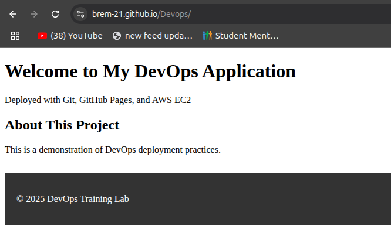

# My Devops Application

# DevOps Training Lab: Git, GitHub, and Deployment

## Lab Overview
This hands-on lab guides you through version control with Git, collaboration on GitHub, and deploying a simple web application to both GitHub Pages and an AWS EC2 instance.

**Duration:** 3-4 hours  
**Difficulty:** Beginner to Intermediate

## Prerequisites
- GitHub account
- AWS account with EC2 access
- Git installed locally
- SSH client
- Text editor (VS Code, Sublime, etc.)
- Basic command line knowledge

## Lab Structure

### Part 1: Git Fundamentals 
- Initial Git setup and configuration
- Creating local repositories
- Basic Git operations (add, commit, status, log)
- Branching and merging workflows

### Part 2: GitHub Collaboration 
- Creating remote repositories
- Connecting local to remote
- Collaborative workflows
- Pull request process

### Part 3: Deploy to GitHub Pages 
- Configuring GitHub Pages
- Testing deployment
- Verifying live site


### Part 4: Deploy to AWS EC2
- Launching EC2 instances
- Installing and configuring Nginx
- Deploying applications
- Creating deployment scripts


### Part 5: Advanced Challenges
- SSH keys for GitHub
- CI/CD with GitHub Actions
- HTTPS with Let's Encrypt
- Blue-Green deployment

## Quick Start Commands

### Git Setup
```bash
git config --global user.name "Your Name"
git config --global user.email "your.email@example.com"
git init
```

### Basic Workflow
```bash
git add .
git commit -m "Your commit message"
git push origin main
```

### EC2 Deployment
```bash
ssh -i ~/.ssh/devops-lab-key.pem ubuntu@YOUR_EC2_PUBLIC_IP
sudo apt update && sudo apt install nginx git -y
sudo git clone https://github.com/YOUR_USERNAME/my-devops-app.git /var/www/html/
```

## Learning Outcomes
After completing this lab, you will be able to:
- Use Git for version control (init, add, commit, branch, merge)
- Collaborate using GitHub (push, pull, pull requests)
- Deploy static sites to GitHub Pages
- Launch and configure AWS EC2 instances
- Install and configure web servers (Nginx)
- Deploy applications to production servers
- Create deployment automation scripts
- Troubleshoot common deployment issues

## Troubleshooting

### Common Git Issues
- **Authentication failed:** Check credentials or use SSH keys
- **Merge conflicts:** Use `git status` to identify conflicts, edit files, then `git add` and `git commit`
- **Detached HEAD:** Use `git checkout main` to return to main branch

### GitHub Pages Issues
- **404 error:** Ensure files are in root directory or correct subfolder
- **Changes not appearing:** GitHub Pages can take a few minutes to update
- **CSS not loading:** Check file paths are relative

### EC2 Issues
- **Can't connect via SSH:** Check security group allows port 22 from your IP
- **Can't access website:** Check security group allows port 80
- **Permission denied:** Use `sudo` for system operations

## Resources
- [Git Documentation](https://git-scm.com/doc)
- [GitHub Guides](https://guides.github.com/)
- [GitHub Pages Documentation](https://docs.github.com/en/pages)
- [AWS EC2 Documentation](https://docs.aws.amazon.com/ec2/)
- [Nginx Documentation](https://nginx.org/en/docs/)

## Lab Completion Checklist
- [ ] Created local Git repository
- [ ] Performed commits, branching, and merging
- [ ] Created GitHub repository
- [ ] Pushed code to GitHub
- [ ] Created and merged pull request
- [ ] Deployed to GitHub Pages
- [ ] Launched EC2 instance
- [ ] Installed and configured Nginx
- [ ] Deployed application to EC2
- [ ] Created deployment script
- [ ] Updated application and redeployed

---

**Note:** This README provides an overview of the DevOps training lab. Follow the detailed exercises in the lab guide for step-by-step instructions.