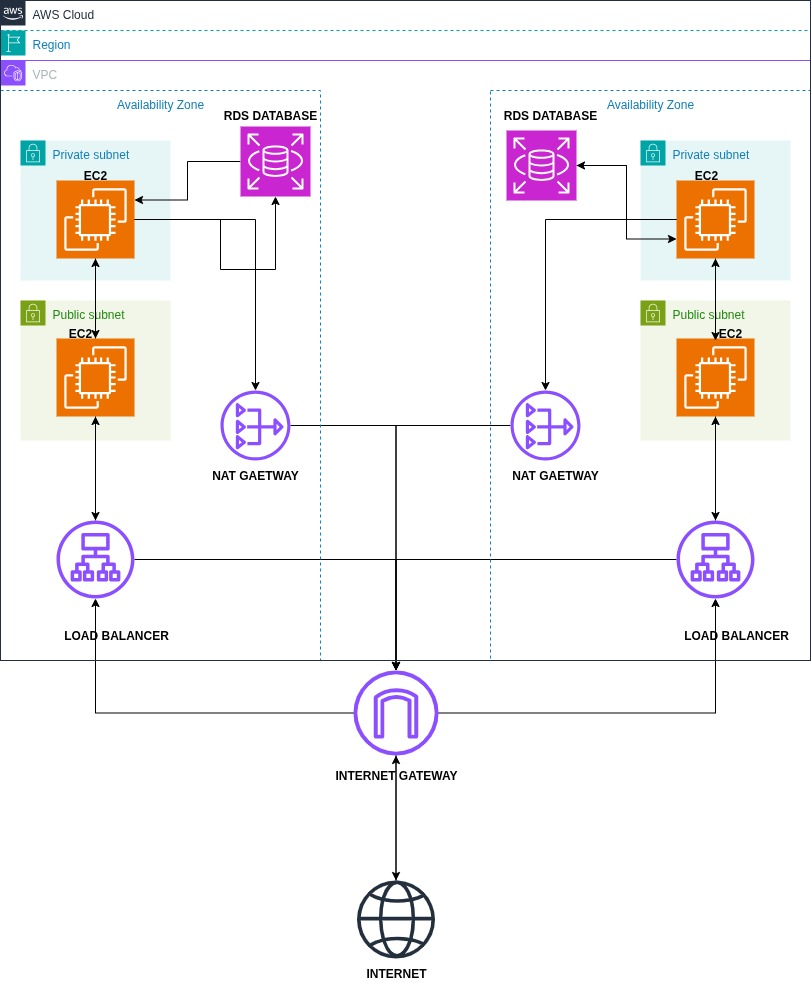

# AWS Well-Architected Review

## Architecture Overview

The following assessment is based on the AWS DevOps architecture diagram shown below:

This architecture represents a **highly available and secure AWS network design** deployed across **two Availability Zones (AZs)** as illustrated in the diagram above.  

Key components visible in the architecture:
- VPC with **public and private subnets** in each AZ  
- EC2 instances in both public (frontend) and private (backend) subnets  
- Multi-AZ **RDS database**  
- **NAT Gateways** for outbound internet from private subnets  
- **Application Load Balancer (ALB)** for distributing traffic  
- **Internet Gateway** for external connectivity

Traffic Flow (as shown in the diagram):  
`Internet → Internet Gateway → ALB → Public EC2 → Private EC2 → RDS`

---

## Pillar 1: Operational Excellence

### **Current State** (Based on aws-devops.jpg)
- EC2 instances and RDS are deployed across multiple AZs as shown in the architecture diagram.
- Load Balancer provides centralized traffic entry point.
- NAT Gateway allows secure outbound communication.
- Basic fault tolerance through AZ redundancy.

### **Risks**
- Limited or no mention of monitoring and alerting (e.g., CloudWatch, alarms).
- No clear CI/CD or automated deployment process.

### **Improvements**
- Implement **CloudWatch metrics, logs, and alarms** for EC2, RDS, ALB, and NAT Gateway.
- Automate deployments using **CodePipeline**, **Terraform**, or **CloudFormation**.
- Enable **AWS Config** for continuous compliance monitoring.

---

## Pillar 2: Security

### **Current State** (Visible in Architecture Diagram)
- Public-facing workloads isolated in public subnets as depicted.
- Backend workloads and RDS are placed in private subnets.
- NAT Gateway ensures no direct inbound access to private resources.

### **Risks**
- Lack of explicit **security groups and NACL configurations** in the diagram.
- No mention of encryption for data in transit or at rest.
- Potential exposure if IAM roles and access controls are not properly scoped.

### **Improvements**
- Apply **least privilege IAM policies** and enforce MFA.
- Enable **encryption** for RDS (at rest) and use HTTPS/TLS for in-transit data.
- Configure **Security Groups and NACLs** to restrict unnecessary traffic.
- Use **AWS WAF** and **Shield** to protect against external threats.
- Enable **GuardDuty** and **Security Hub** for threat detection.

---

## Pillar 3: Reliability

### **Current State** (Architecture Design)
- Multi-AZ deployment provides redundancy for EC2 and RDS as shown in the diagram.
- Load balancers distribute traffic across AZs.
- NAT Gateways in both AZs ensure availability for private subnets.

### **Risks**
- No clear backup and restore strategy for the database.
- No mention of auto-scaling for EC2 instances.
- Possible single point of failure if ALB configuration is not redundant.

### **Improvements**
- Enable **RDS automated backups** and **cross-region snapshots**.
- Configure **Auto Scaling Groups** for EC2 to handle failures or demand spikes.
- Use **Route 53 health checks** and DNS failover.
- Test **disaster recovery plans** regularly.

---

## Pillar 4: Performance Efficiency

### **Current State**
- Load Balancer helps distribute traffic efficiently.
- NAT Gateways offload internet access management from private instances.
- Multi-AZ ensures load distribution and low latency.

### **Risks**
- EC2 instance types and sizes are not optimized.
- NAT Gateway costs and throughput might be a bottleneck under heavy load.
- No mention of caching or CDN.

### **Improvements**
- Use **Auto Scaling** to match capacity to demand.
- Right-size EC2 instances and enable **RDS performance insights**.
- Integrate **Amazon CloudFront** or caching layer for improved response times.
- Consider **Graviton-based EC2** for better performance and cost.

---

## Pillar 5: Cost Optimization

### **Current State**
- Using managed services like ALB, RDS, NAT Gateway can simplify operations but adds costs.
- Multi-AZ improves availability but increases resource usage.

### **Risks**
- NAT Gateways can accumulate high costs over time.
- Over-provisioning of EC2 or RDS instances.
- No evidence of cost monitoring or optimization.

### **Improvements**
- Enable **AWS Cost Explorer** and **Budgets** with alerts.
- Use **Savings Plans** or **Reserved Instances** for predictable workloads.
- Optimize NAT usage — consider **NAT instance** or **VPC endpoints** for specific services.
- Periodically **right-size** infrastructure.

---

## Pillar 6: Sustainability

### **Current State**
- Multi-AZ architecture ensures availability but increases energy usage.
- No mention of resource utilization optimization or carbon impact considerations.

### **Risks**
- Over-provisioning leads to unnecessary energy consumption.
- Idle or underutilized EC2 instances contribute to waste.
- NAT Gateway and load balancers run continuously regardless of usage.

### **Improvements**
- Adopt **auto-scaling** and on-demand resource usage to minimize idle capacity.
- Use **Graviton processors** for energy efficiency.
- Regularly review and **decommission unused resources**.
- Use **Sustainability Dashboard** in AWS to monitor carbon footprint.
- Prefer serverless options (e.g., Lambda, Aurora Serverless) where appropriate.

---

## Summary Table

| Pillar                   | Current Strength                              | Key Risks                                         | Recommended Improvements                                                         |
|---------------------------|-----------------------------------------------|---------------------------------------------------|------------------------------------------------------------------------------------|
| Operational Excellence    | Multi-AZ, ALB, NAT                           | No monitoring or CI/CD                             | CloudWatch, Terraform, runbooks                                                    |
| Security                  | Network segmentation                         | No encryption, IAM risks                           | WAF, encryption, least privilege, GuardDuty                                        |
| Reliability               | Redundant AZ, Load Balancer                  | No backups, no autoscaling                         | Auto Scaling, backups, Route 53 failover                                          |
| Performance Efficiency    | Load Balancing, NAT                          | No caching, no optimization                        | CloudFront, right-sizing, Graviton                                                |
| Cost Optimization         | Managed services                             | NAT costs, over-provisioning                       | Budgets, reserved instances, right-sizing                                        |
| Sustainability            | Efficient design base                        | Over-provisioning, idle resources                  | Auto scaling, Graviton, sustainability metrics                                   |

---

**Final Note:**  
The architecture shown in aws-devops.jpg provides a strong foundation for a **highly available, secure, and scalable web application**. By implementing the recommended improvements across all six pillars of the AWS Well-Architected Framework, the environment can become more **resilient**, **cost-efficient**, and **sustainable**.

This assessment demonstrates how visual architecture diagrams can be systematically evaluated against Well-Architected principles to identify strengths and improvement opportunities.

